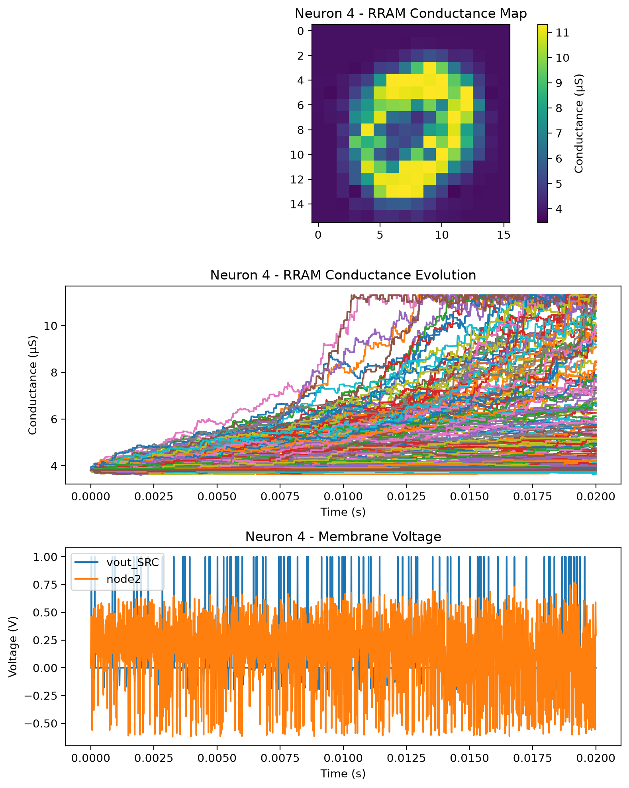

# RRAM-Based STDP Spiking Neural Network

A circuit-level spiking neural network (SNN) simulator built with Cadence
Spectre, Verilog-A RRAM synapses, analog integrate-and-fire neurons, and
spike-timing-dependent plasticity (STDP).

The current Python flow converts MNIST images to configurable square spike
grids, generates a Spectre-compatible network deck, runs transient learning,
and produces static and animated RRAM conductance maps. The default
configuration uses a **16×16 input grid (256 synapses per neuron)** and four
laterally inhibited neurons.

## Demo

<p align="left">
  
</p>

<p align="left">
  <em>Time-resolved RRAM conductance map for neuron 4. This representative
  animation uses the supported 8×8 compatibility mode; new default runs
  produce 16×16 maps.</em>
</p>

<p align="left">
  
</p>

## What the project implements

- MNIST resizing to a configurable square grid; 16×16 is the current default.
- Rate-based Poisson spike encoding and compact PWL voltage-source generation.
- Four analog neurons with 256 RRAM synapses per neuron by default.
- Physical SET/RESET learning through paired pre- and post-synaptic waveforms.
- Resistance-adaptive programming voltage for more uniform conductance change.
- Configurable positive/negative STDP branch asymmetry.
- Lateral inhibition for competitive, winner-take-all behavior.
- Spectre APS acceleration, selected-signal saving, and uniform output strobing.
- Static conductance/membrane plots and animated synaptic-weight maps.
- Independent STDP timing and initial-gap characterization.

## Architecture

For each input channel, the encoded spike drives two coupled paths:

1. `adaptive_spikegen.va` shapes the pre-synaptic programming waveform using
   the live RRAM resistance.
2. `rram.va` updates the filament gap and exposes the current read resistance.
3. `follow_res.va` applies that resistance to the neuron input path.
4. The op-amp, capacitor, comparator, and pulse-generator network integrates
   the weighted inputs and emits a post-synaptic spike.
5. The post spike returns to all RRAM devices in that neuron and also drives
   lateral NMOS inhibition of the other neurons.

The same RRAM and spike-generator models are used by the full training flow
and the standalone STDP-window sweep.

## Requirements

- Python 3.10 or newer
- Cadence Spectre available on `PATH`, or supplied with `--spectre`
- A valid Spectre license
- Python packages listed in `requirements.txt`

Python dependencies:

- NumPy
- Matplotlib
- h5py
- Pillow

## Quick start

Run all commands from the repository root.

### 1. Create the Python environment

```bash
python3 -m venv .venv
source .venv/bin/activate
python3 -m pip install -r requirements.txt
```

### 2. Encode MNIST

Generate the default 16×16, 256-channel input:

```bash
python3 main_encoding.py --image-size 16 --seed 1 --no-plot
```

The first run downloads the MNIST training images and labels if they are not
already present. Cached resolution-specific datasets and spike trains are
reused on later runs.

Use `--rebuild-spikes` after changing the image size, sample duration, spike
bin, maximum spike rate, or Poisson seed:

```bash
python3 main_encoding.py --image-size 16 --duration-us 100 --dt-us 1 --max-spikes 40 --targets 0 4 7 --samples-per-class 20 --seed 1 --rebuild-spikes --no-plot
```

### 3. Run the STDP network

```bash
python3 main_stdp.py --inputs 256 --neurons 4 --threads 8 --no-show
```

The transient duration is read automatically from the generated PWL header.
The normal run uses a 0.2 µs maximum timestep and the same default saved-data
period.

For a smaller result file, keep the internal 0.2 µs limit but save once per
microsecond:

```bash
python3 main_stdp.py --inputs 256 --timestep-us 0.2 --save-period-us 1 --threads 8 --no-show
```

For an exploratory run:

```bash
python3 main_stdp.py --inputs 256 --timestep-us 1 --save-period-us 1 --fast-sim --threads 8 --no-show
```

`--fast-sim` enables relaxed Spectre settings. Validate important spike counts,
conductance maps, and final measurements against a normal run.

### 4. Replot an existing result

```bash
python3 main_stdp.py --plot-existing --no-show
```

Generate only the animated weight maps:

```bash
python3 main_stdp.py --plot-existing --animation-only --animation-frames 80 --animation-fps 10 --no-show
```

## Original 8×8 compatibility mode

The original 64-input configuration remains supported:

```bash
python3 main_encoding.py --image-size 8 --seed 1 --rebuild-spikes --no-plot
python3 main_stdp.py --inputs 64 --neurons 4 --threads 8 --no-show
```

The image size and network input count must agree:

```text
number of inputs = image size × image size
```

## STDP-window characterization

Sweep both pre/post timing and initial RRAM gap:

```bash
python3 plot_stdp_window.py --delta-min-us -4 --delta-max-us 4 --delta-step-us 0.25 --gap-min-nm 0.9 --gap-max-nm 1.1 --gap-step-nm 0.025 --plot-metric conductance --learning-rate-scale 0.20 --positive-dt-dg-ratio 0.40 --no-show
```

The sweep writes:

- `stdp_window/stdp_window.png`
- `stdp_window/stdp_window.csv`
- `stdp_window/stdp_window.scs`
- `stdp_window/stdp_window.raw`
- `stdp_window/spectre.log`

Here, `delta-t = t_post - t_pre` at the falling threshold crossings that start
the programming ramps. Positive `delta-t` means the pre-synaptic event occurs
first.

## Main configuration defaults

| Setting | Default |
|---|---:|
| Input image | 16×16 |
| Inputs per neuron | 256 |
| Neurons | 4 |
| Maximum Spectre timestep | 0.2 µs |
| Saved-data period | same as timestep |
| Base initial RRAM gap | 1.0 nm |
| Gaussian gap variation | 1% |
| Calibrated initial-gap range | 0.9–1.1 nm |
| Membrane/comparator control | 0.40 V |
| Adaptive voltage reference | −0.422 V at 263,244 Ω |
| Adaptive magnitude limits | 0.01–0.50 V |
| SET/RESET equalization exponents | 1.61 / 2.02 |
| Equalization curvature | 0.30 |
| Base learning-rate scale | 0.20 |
| Positive-`delta-t` RESET ratio | 0.40 |
| Spectre execution | APS, 8 threads |
| Animation | 80 frames at 10 fps |

Gaussian initial-gap samples are bounded to 0.9–1.1 nm, the range used to
calibrate the adaptive conductance-update controller.

## Output files

The default training work directory is `temp/`:

```text
temp/
├── stdp.sp                       generated Spectre-compatible network
├── out.raw                       selected Nutmeg ASCII transient result
├── spectre.log                   Spectre run log
└── figures/
    ├── neuron_1.png              final map, conductance traces, voltages
    ├── neuron_1_weights.gif      animated conductance map
    └── ...                       one PNG and GIF per neuron
```

Export a raw result to CSV:

```bash
python3 import_data.py temp/out.raw --csv temp/out.csv
```

## Project layout

| Path | Purpose |
|---|---|
| `main_encoding.py` | MNIST loading, resizing, Poisson encoding, and PWL generation |
| `main_stdp.py` | Network generation, Spectre execution, result parsing, and plotting |
| `plot_stdp_window.py` | Physical STDP timing/gap sweep |
| `import_data.py` | Spectre Nutmeg ASCII reader and CSV exporter |
| `rram.va` | Electrothermal RRAM device and state-update model |
| `adaptive_spikegen.va` | Resistance-aware synaptic programming waveform |
| `spikegen.va` | Fixed post-synaptic programming ramp |
| `follow_res.va` | Live RRAM-controlled read resistance |
| `edge_to_pulse.va` | Comparator-edge to output-pulse conversion |
| `cmp.sp` | Five-transistor comparator |
| `TLV2372.LIB` | Op-amp macromodel |
| `README_SPECTRE.md` | Detailed implementation and option notes |
| `commands.txt` | Additional command-line examples |

The MATLAB and HSPICE files are retained as references for the original flow.

## Notes and limitations

- A 16×16, four-neuron run contains 1,024 RRAM devices and can be
  computationally expensive.
- Increasing `--save-period-us` reduces raw-result size without relaxing the
  internal solver limit.
- Keep the save period at or below the 1 µs output-spike width when spike
  visibility is required.
- The current generator samples one initial gap per neuron and applies it to
  that neuron's synapses; it does not yet assign independent initial mismatch
  to every RRAM device.
- The project currently demonstrates unsupervised conductance learning. A
  complete label-assignment, inference, and held-out accuracy stage is not yet
  included.
- Generated datasets, raw simulation files, and full figure sets can be large
  and normally should not be committed.

## Adding the demo to Git

The README expects this exact repository-relative path:

```text
temp/figures/neuron_4_weights.gif
```

If your ignore rules exclude generated GIFs, add this demo explicitly:

```bash
git add -f temp/figures/neuron_4_weights.gif
```
