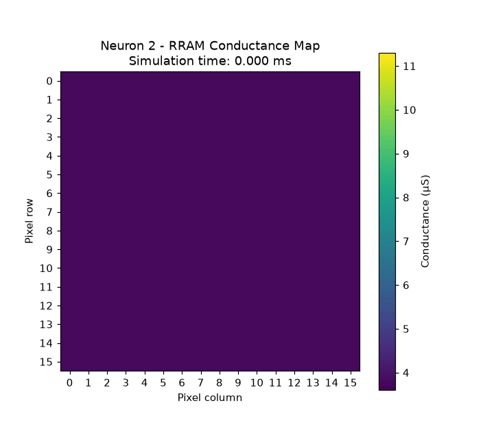
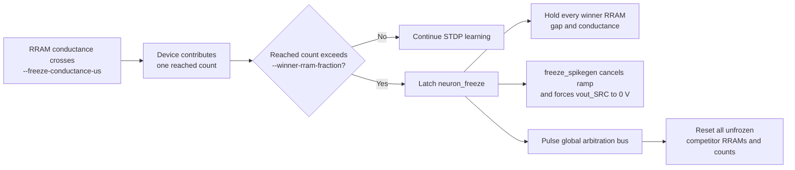
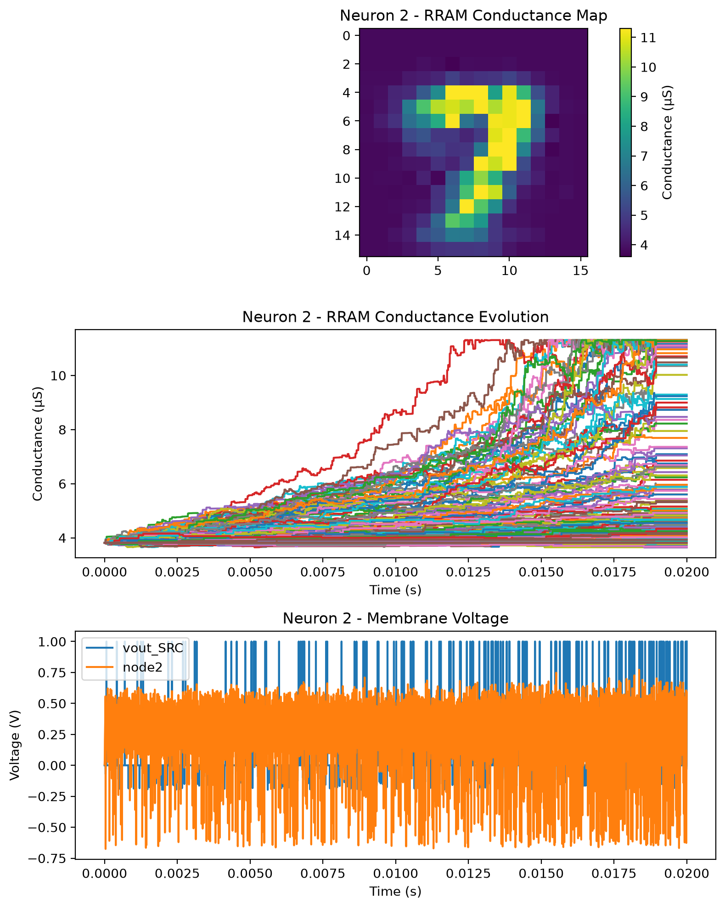
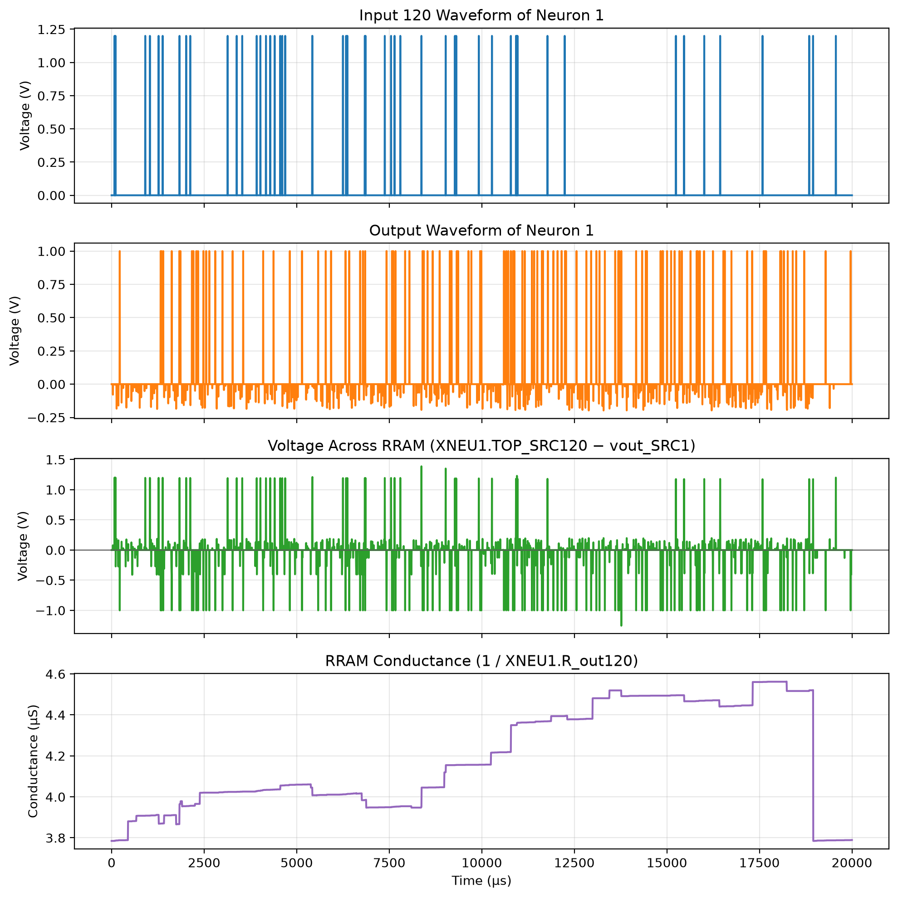
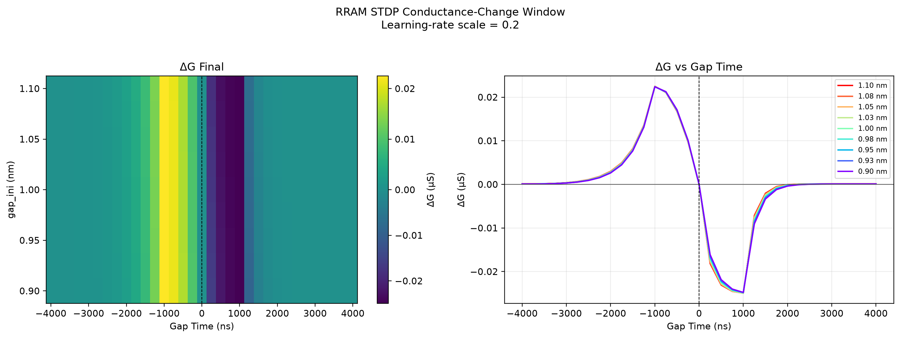
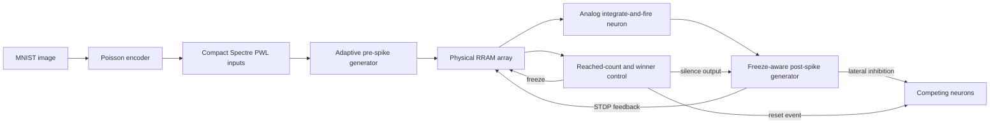

# RRAM–STDP Spiking Neural Network in Cadence Spectre

This project is a circuit-level spiking neural network (SNN) simulator built
around physical RRAM synapses, analog integrate-and-fire neurons, and
spike-timing-dependent plasticity (STDP). A Python 3 workflow converts MNIST
images into compact spike sources, generates a Spectre-compatible netlist,
runs transient learning, and turns the saved device states into static and
animated conductance maps.

The implementation preserves the topology and learning logic of the original
MATLAB/HSPICE project while adding a native Python/Spectre flow,
resistance-adaptive programming pulses, asymmetric SET/RESET learning,
competitive neuron freezing, selective waveform saving, and reusable result
plotting.

<p align="center">
  
</p>

<p align="center"><em>Time-resolved RRAM conductance map from a representative 16×16 training run.</em></p>

## Main innovations

- **Physical circuit-level learning:** RRAM conductance changes are produced by
  the simulated voltage difference across each device, rather than by an
  offline numerical weight update.
- **Resistance-adaptive programming:** `adaptive_spikegen.va` changes the ramp
  magnitude using live RRAM resistance so that the conductance update remains
  much more uniform across the calibrated 0.9–1.1 nm initial-gap range.
- **Tunable STDP asymmetry:** the positive-`delta-t` conductance-decrease branch
  can be scaled independently with `--positive-dt-dg-ratio`.
- **Circuit-level winner competition:** neurons count synapses that reach a
  conductance criterion, select a winner, preserve its learned state, and reset
  competitors through a shared arbitration event.
- **Freeze-aware spike suppression:** a selected neuron not only freezes its
  RRAM states; it also stops emitting post-synaptic programming spikes.
- **Practical Spectre output control:** only required state signals and a
  selected device waveform are saved by default, reducing raw-result size
  without altering circuit dynamics.

## The freeze process

The freeze path is designed to prevent a trained winner from continuing to
dominate the network or pushing its already-strong synapses to still higher
conductance.



Three thresholds have different meanings:

| Parameter | Purpose | Default |
|---|---|---:|
| `--freeze-conductance-us` | Conductance at which one RRAM contributes a reached count | 12 µS |
| `--winner-rram-fraction` | Fraction of reached RRAMs that must be strictly exceeded to select the neuron | 0.20 |
| `freeze_threshold` | Voltage threshold used by Verilog-A modules to recognize the local freeze signal | 0.5 V |

For the default 256-input network, a fraction of `0.20` selects a winner when
the 52nd RRAM reaches the conductance criterion. `RRAM_NEURON_CONTROL` then
latches the neuron-local `neuron_freeze` signal. That signal has two coordinated
effects:

1. `rram_neuron_freeze.va` sets the winner's gap derivative to zero, preserving
   all learned conductances.
2. `freeze_spikegen.va` cancels an active output ramp and smoothly gates
   `vout_SRC` to exactly 0 V, so the frozen neuron can no longer generate
   post-synaptic learning pulses or inhibit competitors with new spikes.

The shared `global_training_event` is used only for winner arbitration and
competitor reset. Spike suppression is driven by the persistent local freeze
signal, so selecting one neuron does not incorrectly silence the entire
network.

## Demonstration results

### Learned winner-neuron state

<p align="center">
  
</p>

The static summary combines the final 16×16 conductance map, all device
conductance trajectories, and the neuron's membrane/output activity. The
animated figure at the top shows how this map develops over simulation time.

### Voltage and conductance of one physical synapse

<p align="center">
  
</p>

This diagnostic view connects the abstract STDP update to the simulated
device: it plots the input spike, neuron output, differential voltage across
one RRAM, and the resulting conductance trajectory.

### Two-dimensional physical STDP window

<p align="center">
  
</p>

The standalone sweep measures `delta-G` versus `t_post - t_pre` and initial
RRAM gap. The nearly overlapping curves across 0.9–1.1 nm illustrate the
resistance-adaptive ramp calibration, while the positive and negative timing
branches retain opposite update directions.

## Architecture

Each encoded pixel drives one synapse in every neuron:



The default network uses 256 inputs (a 16×16 image) and four neurons. Input
count and encoded image size must agree:

```text
number of inputs = image size × image size
```

## Requirements

- Python 3.10 or newer
- Cadence Spectre available on `PATH` and a valid Spectre license
- Python packages from `Full/requirements.txt`

Create the environment from the repository root:

```bash
python3 -m venv .venv
source .venv/bin/activate
python3 -m pip install -r Full/requirements.txt
```

## Quick start

Run the simulation scripts from `Full/`:

```bash
cd Full
```

Generate a 16×16 MNIST spike dataset with samples grouped in target order:

```bash
python3 main_encoding.py --image-size 16 --duration-us 100 --dt-us 1 --max-spikes 40 --targets 2 4 7 8 --samples-per-class 20 --seed 1 --rebuild-spikes --no-plot
```

Run the default four-neuron Spectre training flow:

```bash
python3 main_stdp.py --inputs 256 --neurons 4 --timestep-us 0.2 --save-period-us 1 --base-gap 1e-9 --gap-sigma 0.01 --mem-threshold 0.40 --learning-rate-scale 0.20 --positive-dt-dg-ratio 0.40 --freeze-conductance-us 12 --winner-rram-fraction 0.20 --threads 8 --no-show
```

For a faster exploratory run, use a coarser timestep and relaxed Spectre
settings, then validate important results with the normal command:

```bash
python3 main_stdp.py --inputs 256 --neurons 4 --timestep-us 1 --save-period-us 5 --fast-sim --threads 8 --no-show
```

Replot an existing result without rerunning Spectre:

```bash
python3 main_stdp.py --plot-existing --waveform-input 120 --waveform-neuron 1 --no-show
```

Characterize the STDP timing/gap surface:

```bash
python3 plot_stdp_window.py --delta-min-us -4 --delta-max-us 4 --delta-step-us 0.25 --gap-min-nm 0.9 --gap-max-nm 1.1 --gap-step-nm 0.025 --plot-metric conductance --learning-rate-scale 0.20 --positive-dt-dg-ratio 0.40 --no-show
```

## Project layout

| Path | Role |
|---|---|
| `Full/main_encoding.py` | MNIST resizing, ordered sample selection, Poisson encoding, and compact PWL generation |
| `Full/main_stdp.py` | Network generation, Spectre execution, raw-data parsing, and PNG/GIF plotting |
| `Full/plot_stdp_window.py` | Independent timing and initial-gap sweep |
| `Full/rram.va` | Base electrothermal RRAM model |
| `Full/rram_neuron_freeze.va` | Resettable/freezeable RRAM state and reached-count contribution |
| `Full/rram_neuron_control.va` | Winner selection, persistent freeze, and competitor-reset arbitration |
| `Full/adaptive_spikegen.va` | Resistance-aware synaptic programming waveform |
| `Full/freeze_spikegen.va` | Post-synaptic waveform with persistent freeze gating |
| `Full/spikegen.va` | Original two-terminal generator retained for isolated STDP sweeps |
| `Full/import_data.py` | Spectre Nutmeg ASCII reader and CSV exporter |
| `Full/commands.txt` | Extended command examples and parameter notes |

Generated training artifacts are written to `Full/temp/`, including the
Spectre deck, raw output, run log, static PNG summaries, and animated RRAM
weight maps. See [Full/README_SPECTRE.md](Full/README_SPECTRE.md) for detailed
implementation and simulator-option notes.

## Current scope

The framework demonstrates device- and circuit-level online learning. It does
not yet include a held-out inference stage, automatic neuron-to-class mapping,
or a classification-accuracy benchmark. Long Spectre runs should be treated as
experiments: preserve the generated deck and log, and compare fast-mode results
against the normal accuracy settings before drawing quantitative conclusions.
